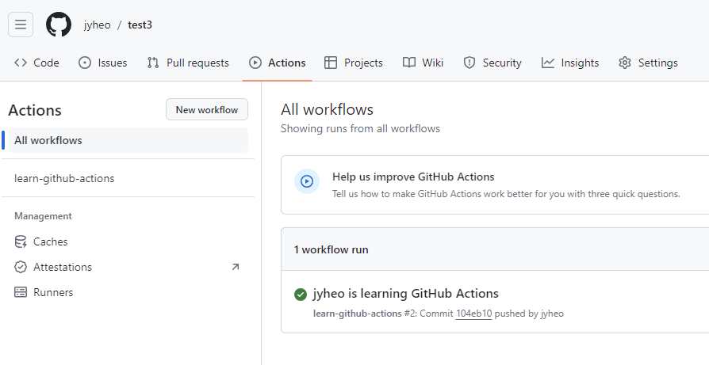
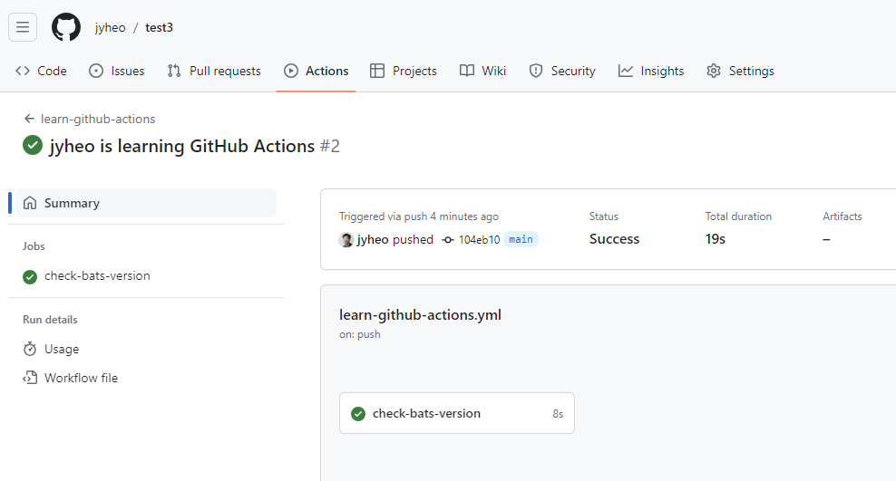
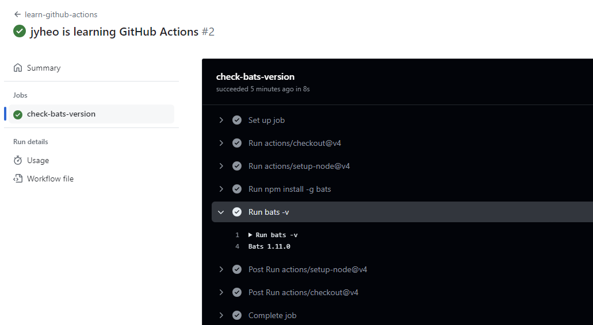
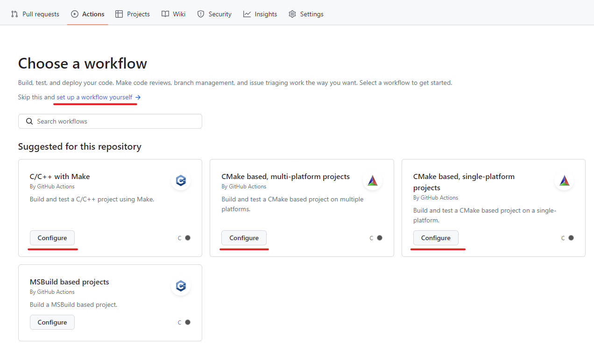
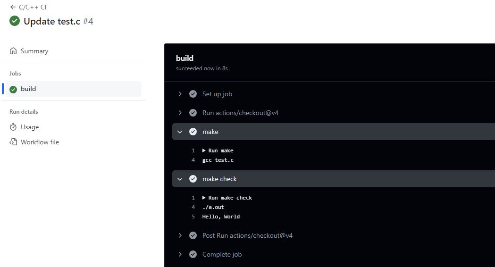

# CI/CD
<!-- _class: lead -->
### 허준영(jyheo@hansung.ac.kr)

## CI(Continuous Integration) & CD(Continuous Delivery)
- Continuous Integration
    - 지속적으로 퀄리티 컨트롤을 적용하는 프로세스를 실행
    - 기존 통합 방식의 문제점:
        - 원격 저장소에서 코드를 pull해서 작업을 오래하면
        - 언젠가는 저장소가 pull 했을 때와 너무 많이 달라지게 됨
        - 작업하는 시간보다 작업 내용을 통합하는데 걸리는 시간이 더 걸리게 되는 ‘통합의 지옥’이 발생
    - 지속적 통합은 ‘통합 지옥’이 생기지 않도록 자주 통합
- Continuous Delivery
    - 빌드, 테스트 뿐 아니라 배포까지 자동화
- DevOps (개발과 운영을 함께)를 위한 기반 플랫폼
- CI/CD 도구
    - (클라우드) Github Actions, Travis-CI 
    - (설치형) Jenkins

## Github Actions
- Gihub에서 제공하는 CI/CD 플랫폼
- 빌드, 테스트, 배포를 자동화하는 workflow를 만들어 사용
- 저장소(repository)로 pull 할 때마다 빌드와 테스트하는 workflow를 동작시킴
- workflow를 Github에서 제공하는 리눅스, 윈도우, MacOS 가상 머신에서 동작시키거나 자신의 데이터 센터나 다른 클라우드에서도 동작 가능
- Workflow
    - pull request나 issue 생성과 같은 이벤트에 의해 자동 실행되는 workflow를 정의
    - 순차 또는 병렬로 실행 가능한 하나 이상의 작업으로 구성됨
    - 각 작업은 가상 머신이나 컨테이너에서 수행되며, 미리 정의된 스크립트나 액션(action)을 실행


## Github Actions - Workflows
- YAML 형식 파일로 작성, 저장소에 포함
- 이벤트 발생할 때 자동 실행되거나 스케줄에 따라 실행
- 직접 실행도 가능
- 저장소의 .github/workflows 에 저장
- 여러개의 workflows 저장 가능
    - pull request 마다 빌드와 테스트를 수행
    - release가 생성될 때마다 배포하는 작업 수행
    - 새 이슈를 생성할 때마다 레이블 추가 수행
- 다른 workflow에서 참조도 가능

## Github Actions - Events
- Workflow를 시작하는 트리거 역할을 하는, 저장소와 관련된 활동
- 예)
    - 누군가 pull request를 생성
    - 이슈를 생성
    - 저장소에 커밋을 push
- 스케줄에 따라 트리거를 동작시키거나 REST API를 통하거나 직접 트리거 동작 가능

## Github Actions - Jobs
- 동일한 runner에서 실행되는 workflow에서의 단계(step)들의 집합
- 각 단계는 스크립트나 액션이 될 수 있음
- 각 단계는 순서대로 수행되거나 다른 단계에 의존되어 수행 될 수 있음
- 동일한 runner에서 수행되기 때문에 다른 단계와 데이터 공유가 가능
    - 예를 들어 빌드 단계의 결과물을 이용해 테스트 단계에서 사용

## Github Actions - Actions
- 액션(action)은 Github Actions 플랫폼에서 복잡하지만 자주 사용되는 태스크를 수행하는 커스텀 응용
- workflow에서 액션을 사용함으로써 반복되는 코드를 줄일 수 있음
- 액션의 예
    - Github에서 pull 하기
    - 빌드 환경에 맞게 툴체인 셋업하기
    - 클라우드에 접근하기 위해 인증 셋업하기
- 직접 액션을 만들 수도 있고, Github Marketplace에서 적절한 액션을 골라 사용할 수 있음.
- https://github.com/marketplace?type=actions

## Github Actions - Runners
- workflows를 실행하는 서버
- 각 runner는 한번에 하나의 job을 실행
- Github에서 제공하는 가상 머신: Ubuntu Linux, Microsoft Windows, macOS
- workflow는 새로 만들어진 가상 머신에서 수행됨
- 특별한 설정의 시스템의 runner가 필요하면 직접 호스팅한 시스템을 사용할 수 있음.


## 간단한 Workflow 만들기
- 저장소에 push할 때마다 간단한 workflow를 동작, 이 workflow에서는 bats 테스팅 프레임워크를 설치하고 bats를 실행 (bats -v)
- 테스트용 저장소를 하나 만들고, 그 안에 .github/workflows/ 폴더를 만들고 learn-github-actions.yml 을 추가 (저장소에 commit/push 해야함)
- learn-github-actions.yml 파일의 내용:
 ```yaml
name: learn-github-actions
run-name: ${{ github.actor }} is learning GitHub Actions
on: [push]
jobs:
  check-bats-version:
    runs-on: ubuntu-latest
    steps:
      - uses: actions/checkout@v4
      - uses: actions/setup-node@v4
        with:
          node-version: '20'
      - run: npm install -g bats
      - run: bats -v
 ```

## 간단한 Workflow 만들기
- name: workflow 이름, 저장소의 Actions 탱베 표시됨, 생략하면 파일 이름이 사용됨
- run-name: 실행 중인 workflow 이름, 저장소의 Actions 탭에 표시됨
    - github.actor 는 workflow 트리거시킨 사용자 이름
- on: 트리거 이벤트 정의
    - push, 특정 브랜치나 경로에 대한 push로 한정도 가능
- jobs: job 정의 시작
- check-bats-version: job 이름 정의
    - runs-on : runner 지정
    - steps: 이 job의 단계(step)들
        - -uses: 사전 정의된 액션 사용
        - -run: 명령어 수행
- uses: actions/checkout@v4 - 저장소의 소스를 runner에 checkout
- uses: actions/setup-node@v4 with: node-version: '20' 노드 버전 20을 셋업
- @v4는 액션의 버전을 의미

## 간단한 Workflow 만들기
- Github 저장소에서 Actions 탭을 누르면 생성한 workflow 확인 가능


## 간단한 Workflow 만들기
- 아무 파일이나 수정하고 push하기 (또는 github 사이트에서 파일을 수정하고 commit 해도 됨)
- workflow 실행 결과 확인


## 간단한 Workflow 만들기



## Starter Workflow
- New workflow 를 눌러서 workflow 템플릿에서 골라서 시작하기
    - Action이 없으면 템플릿 고르는 화면이 바로 나옴


## Starter Workflow



## Starter Workflow
- C/C++ with Make 의 Configure를 선택
```yml
name: C/C++ CI
on:
  push:
    branches: [ "main" ]
  pull_request:
    branches: [ "main" ]
jobs:
  build:
    runs-on: ubuntu-latest
    steps:
    - uses: actions/checkout@v4
    - name: configure   <- 삭제
      run: ./configure  <- 삭제
    - name: make
      run: make
    - name: make check
      run: make check
    - name: make distcheck  <- 삭제
      run: make distcheck   <- 삭제
```

## Starter Workflow
- Makefile
```Makefile
all:
	gcc test.c

check:
	./a.out
```
- test.c
```c
#include <stdio.h>

int main()
{
	printf("Hello, World");
	return 0;
}
```

## Starter Workflow
- commit/push 한 후 Actions 결과 확인



## Exercise 1
- Github에 Repository 생성
- git clone
- test.c 파일 생성, 적당한 내용을 출력하도록 작성, commit/push
- Makefile 파일 생성, make all, make test 가능하게
- Actions 탭에서 workflow 생성, C/C++ 템플릿 사용
    - on: [push]
    - step에 make all, make test 수행
- test.c 파일 업데이트, commit/push
- Actions 에서 결과 확인


